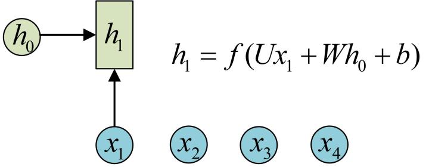

# tensorflow 安装
$ sudo pip3 install tensorflow -i https://pypi.tuna.tsinghua.edu.cn/simple


# 创建 RNNCell
RNNCell 是 TensorFlow 中实现 RNN 的基本单元，每个 RNNCell 都有一个 `__call__` 方法，使用方式是：`(output, next_state) = cell.__call__(input, state)`。
借助图片来说可能更容易理解。假设我们有一个初始状态 h0，还有输入 x1，调用 `__call__(x1, h0)` 后就可以得到 (output1, h1)：



再调用一次 `__call__(x2, h1)` 就可以得到 (output2, h2)：


也就是说，每调用一次 RNNCell 的 `__call__` 方法，就相当于在时间上“推进了一步”，这就是 RNNCell 的基本功能。

在代码实现上，RNNCell 只是一个抽象类，我们用的时候都是用的它的两个子类 BasicRNNCell 和 BasicLSTMCell。
顾名思义，前者是 RNN 的基础类，后者是 LSTM 的基础类。除了 `__call__` 方法外，对于 RNNCell，还有两个类属性比较重要：
- state_size
  隐层的大小
- output_size
  输出的大小

比如我们通常是将一个 batch 送入模型计算，设输入数据的形状为 (batch_size, input_size)，
那么计算时得到的隐层状态就是 (batch_size, state_size)，
输出就是 (batch_size, output_size)。

## tf.nn.rnn_cell.BasicRNNCell
是最基本的RNN cell单元

入参：
- num_units: 是指一个 Cell 中神经元的个数(state_size)，并不是循环层的 Cell 个数。 
- input_size: 该参数已被弃用。
- activation: 内部状态之间的激活函数。
- reuse: Python 布尔值, 描述是否重用现有作用域中的变量。（tf 高版本才有）


## tf.nn.rnn_cell.GRUCell
入参：
- num_units: 是指一个 Cell 中神经元的个数，并不是循环层的 Cell 个数。 
- input_size: 该参数已被弃用。
- activation: 内部状态之间的激活函数。


## tf.nn.rnn_cell.BasicLSTMCell
BasicLSTMCell 是最简单的一个 LSTM 类，没有实现 clipping，projection layer，peep-hole 等一些 LSTM 的高级变种，仅作为一个基本的 basicline 结构存在，如果要使用这些高级变种，需用 class tf.contrib.rnn.LSTMCell 这个类。

tf.nn.rnn_cell.BasicLSTMCell(num_units, forget_bias=1.0, state_is_tuple=False)  # tf version 0.9
入参：
- num_units: 是指一个 Cell 中神经元的个数，并不是循环层的 Cell 个数。
- forget_bias: 就是 LSTM 们的忘记系数，如果等于 1，就是不会忘记任何信息。如果等于 0，就都忘记。
- input_size: 该参数已被弃用。
- state_is_tuple: 调用时必须设置为 True，否则会有警告，表示返回的状态用一个元祖表示。 高版本可能默认为 True。
在任意时刻 t，LSTM Cell 会产生两个内部状态 ct 和 ht，当 state_is_tuple=True 时，上面讲到的状态 ct 和 ht 就是分开记录，放在一个二元 tuple 中返回 


# 创建多层 RNNCell
tf.nn.rnn_cell.MultiRNNCell


如果希望整个网络的层数更多（例如上图表示一个两层的RNN，第一层 Cell 的 output 还要作为下一层 Cell 的输入），应该堆叠多个 LSTM Cell，tensorflow 给我们提供了 MultiRNNCell，因此堆叠多层网络只生成这个类即可
cell = tf.nn.rnn_cell.MultiRNNCell([cell] * num_layers, state_is_tuple=True)

# RNNCell.zero_state
这个里面存在一个状态初始化函数，就是 zero_state( batch_size，dtype ) 两个参数。batch_size 就是输入样本批次的数目，dtype 就是数据类型。


# tf.get_variable(name, shape, initializer)
入参：
- name: 变量的名称
- shape: 变量的维度
- initializer: 变量初始化的方式，有以下几种（默认为: UniformUnitScalingInitializer）：
 - tf.constant_initializer: 常量初始化函数
 - tf.random_normal_initializer: 正态分布
 - tf.truncated_normal_initializer: 截取的正态分布
 - tf.random_uniform_initializer: 均匀分布
 - tf.zeros_initializer: 全部是0
 - tf.ones_initializer: 全是1
 - tf.uniform_unit_scaling_initializer: 满足均匀分布，但不影响输出数量级的随机值

例如：
```
embedding = tf.get_variable("embedding", [4, 2])
with tf.Session() as sess:
    sess.run(tf.initialize_all_variables())
    print(sess.run(embedding))
```

输出 -1 ~ 1 之间的随机唯一值：
```
[[ 0.46850413 -0.39362544]
 [ 0.06448364 -0.473811  ]
 [-0.68338203 -0.11122602]
 [-0.81266093 -0.72137576]]
```


# tf.device(device_name)
在 TensorFlow 中，模型可以在本地的 GPU 和 CPU 中运行，用户可以指定模型运行的设备。通常，如果你的 TensorFlow 版本是 GPU 版本的，而且你的电脑上配置有符合条件的显卡，那么在不做任何配置的情况下，模型是默认运行在显卡下的。

如果需要切换成 CPU 运算，可以调用 tf.device(device_name)函数，其中 device_name 格式如 '/cpu:0' 其中的 0 表示设备号，TF 不区分 CPU 的设备号，设置为 0 即可。
GPU 区分设备号 '\gpu:0' 和 '\gpu:1' 表示两张不同的显卡。
在一些情况下，我们即使是在 GPU 下跑模型，也会将部分 Tensor 储存在内存里，因为这个 Tensor 可能太大了，显存不够放，相比于显存，内存一般大多了，于是这个时候就常常人为指定为 CPU 设备。

需要注意的是，这个方法会减少显存的负担，但是从内存把数据传输到显存中是非常慢的，这样做常常会减慢速度。

# tf.nn.embedding_lookup
embedding_lookup(params, ids, partition_strategy='mod', name=None, validate_indices=True)
函数的用法主要是选取一个张量里面索引对应的元素。函数会将 N 维的 ids 转换为 N+1 维的 tensor 对象输出（返回值），增加的一个维度用于把索引映射为 params 中的向量。
- params: 就是输入张量。
- ids: 就是张量对应的索引。
- partition_strategy: 如果是 ‘mod’，我们把每一个 id 分配到间隔 p 的分区中（p = id % len(params)）。例如，13 个 ids 划分为 5 个分区：[[0, 5, 10], [1, 6, 11], [2, 7, 12], [3, 8], [4, 9]]
如果是 ‘div’，我们把用连续的方式将 ids 分配到不同的分区。例如，13 个 ids 划分为 5 个分区：[[0, 1, 2], [3, 4, 5], [6, 7, 8], [9, 10], [11, 12]]

例如：
```
import tensorflow as tf;
import numpy as np;

c = np.random.random([10,1])
b = tf.nn.embedding_lookup(c, [1, 3])
 
with tf.Session() as sess:
    sess.run(tf.initialize_all_variables())
    print( sess.run(b) )
    print( c )
```

输出：  
b:
```
[[ 0.77505197]
 [ 0.20635818]]
```
c:  
```
[[ 0.23976515]
 [ 0.77505197]
 [ 0.08798201]
 [ 0.20635818]
 [ 0.37183035]
 [ 0.24753178]
 [ 0.17718483]
 [ 0.38533808]
 [ 0.93345168]
 [ 0.02634772]]
```
输出为张量的第一和第三个元素。

再来一个二维的例子比较好理解
```
c = tf.get_variable("embedding", [4, 2])
b = tf.nn.embedding_lookup(c, [[1, 3],[2, 1]])

with tf.Session() as sess:
    sess.run(tf.initialize_all_variables())
    print( sess.run(b) )
    print( sess.run(c) )
```
输出：
b:
```
[[[ 0.39770442 -0.85800707]
  [-0.62373674 -0.75450039]]

 [[ 0.16495591 -0.85591155]
  [ 0.39770442 -0.85800707]]]
```
c:  
```
[[ 0.07562721  0.82003707]
 [ 0.39770442 -0.85800707]
 [ 0.16495591 -0.85591155]
 [-0.62373674 -0.75450039]]
```

# tf.nn.dynamic_rnn
output, final_state = tf.nn.dynamic_rnn(cell, input, initial_state=init_state, time_major=True) 
使用该函数就相当于调用了 time_steps 次 `cell.__call__` 函数。即通过 {h0, x1, x2, …, xn} 直接得到 {h1, h2, …, hn}。

入参：
- input: 维度一般是 [batch_size, time_steps, num_units]，time_steps 一般为句子的长度（一句话含有多少个字符）。


- time_major: 如果是 True，就表示 RNN 的 time_steps 用第一个维度表示（input 数据的维度），建议用这个，运行速度快一点。
                  此时 output的维度是[time_steps, batch_size, num_units]。  
           如果是 False，那么输入的第二个维度就是 time_steps，此时 output 的维度是 [batch_size, time_steps, num_units]。


- sequence_length: 假设 input 是 [2, 20, 128]，其中 2 是 batch_size, 20 是文本最大长度，128 是 embedding_size，  
    可以看出，有两个 example，我们假设第二个文本长度只有 13，剩下的 7 个是使用 0-padding 方法填充的。  
    sequence_length，这个参数用来指定每个 example 的长度，比如上面的例子中，我们令 sequence_length 为 [20, 13]，表示第一个 example 有效长度为 20，第二个 example 有效长度为 13，当我们传入这个参数的时候，对于第二个 example，TensorFlow 对于 13 以后的 padding 就不计算了，其 last_states 将重复第 13 步的 last_states 直至第 20 步，而 outputs 中超过 13 步的结果将会被置零。


返回值：
- output: 是 time_steps 步里所有的输出。它的形状为 (batch_size, time_steps, cell.output_size)。
- final_state: 是最后一步的隐状态，它的形状为 (batch_size, cell.state_size)，其中 cell.state_size = 2 * num_units。
  final_state 就是整个 LSTM 输出的最终的状态，包含 c 和 h。c 和 h 的维度都是 [batch_size, num_units]。


看下面这段代码：
```
import tensorflow as tf  

batch_size = 4   
input = tf.random_normal(shape=[3, batch_size, 6], dtype=tf.float32)                    # steps = 3
cell = tf.nn.rnn_cell.BasicLSTMCell(10, forget_bias=1.0, state_is_tuple=True)           # 神经元的个数 = 10 
init_state = cell.zero_state(batch_size, dtype=tf.float32)                              # c 和 h 的 shape 为 (batch_size, state_size): [4, 10]
output, final_state = tf.nn.dynamic_rnn(cell, input, initial_state=init_state, time_major=True)

with tf.Session() as sess:
    sess.run(tf.global_variables_initializer())
    print(sess.run(output))
    print(sess.run(final_state))
```

其输出为：
output, shape == [3, 4, 10]
```
[[[-0.17837059  0.01385643  0.11524696 -0.04611184  0.05751593 -0.02275656
    0.10593235 -0.07636188  0.12855089  0.00768109]
  [ 0.07553699 -0.23295973 -0.00144508  0.09547552 -0.05839045 -0.06769165
   -0.41666976  0.3499622  -0.01430317 -0.02479473]
  [ 0.08574327 -0.05990489  0.06817424  0.03434218  0.10152793 -0.10594042
   -0.25310516  0.07232092  0.064815    0.0659876 ]
  [ 0.15607212 -0.31474397 -0.06477047 -0.06982201 -0.05489461  0.0188695
   -0.30281037  0.39494631 -0.05267519 -0.03253869]]


 [[-0.03209484 -0.06323308 -0.25410452 -0.10886975  0.00253956 -0.08053195
    0.18729064 -0.0788438   0.14781287 -0.20489833]
  [ 0.3164973  -0.10971865 -0.35004857 -0.00576114 -0.08092841  0.00883496
   -0.17579219  0.19092172 -0.0237403  -0.43207553]
  [ 0.2409949  -0.17808972 -0.1486263   0.02179234 -0.21656732  0.0522153
   -0.21345614  0.18841118 -0.0094095  -0.34072629]
  [ 0.12034108 -0.23767222  0.03664704  0.13274716 -0.04165298 -0.04095407
   -0.31182185  0.36334303 -0.01146755  0.05028744]]


 [[-0.12453001 -0.1567502  -0.16580626 -0.03544752  0.06869993  0.09097657
   -0.02214662 -0.18668351  0.06159507 -0.35843855]
  [ 0.2010586   0.03222289 -0.31237942  0.01898964 -0.08158109 -0.02510365
    0.02967031  0.12587228 -0.22250202 -0.08734316]
  [ 0.14316584  0.02029586 -0.1062321   0.02968353 -0.02318866  0.07653226
   -0.13600637 -0.00440343  0.07305693 -0.26385978]
  [ 0.23669831 -0.13415271 -0.10488234  0.03128149 -0.11343875 -0.05327768
   -0.22888957  0.17797095 -0.02945257 -0.18901967]]]
```

final_state c 和 h 的元组, c 和 h 的 shape == [4, 10]
```
LSTMStateTuple(c=array([[-0.72714508,  0.32974839,  0.67756736,  0.11421457,  0.39167076,
         0.31247479,  0.0755761 , -0.62171376,  0.58582318, -0.19749212],
       [ 0.44815305,  0.06901363, -0.88840145,  0.22841501,  0.04539755,
         0.17472507, -0.50547051,  0.46637267, -0.07522876, -0.80750966],
       [-0.19392423, -0.16717091, -0.19510591, -0.48713976, -0.18430954,
         0.1046299 ,  0.30127296, -0.03556332, -0.37671563, -0.1388765 ],
       [-0.47982571,  0.2172934 ,  0.56419176,  0.15874679,  0.29927608,
         0.16362543,  0.11525643, -0.47210076,  0.56833684, -0.18866351]], dtype=float32), 
         
        h=array([[-0.36339632,  0.17585619,  0.29174498,  0.03471305,  0.2237694 ,
         0.13323013,  0.03002708, -0.26190156,  0.28289214, -0.12495621],
       [ 0.1543802 ,  0.04264591, -0.27087522,  0.084597  ,  0.01555507,
         0.10631134, -0.23696639,  0.2758382 , -0.03724022, -0.4389703 ],
       [-0.14088678, -0.10961234, -0.10831701, -0.19923639, -0.10324109,
         0.04290821,  0.10720341, -0.01477169, -0.14518294, -0.04280116],
       [-0.34502122,  0.10841226,  0.32169446,  0.03053316,  0.20867576,
         0.04689977,  0.03286072, -0.11068864,  0.37977526, -0.12110116]], dtype=float32))
```

再看一段关于 sequence_length 的代码：
```
import tensorflow as tf
import numpy as np

batch_size = 2
# 创建输入数据
input = np.random.randn(batch_size, 10, 8).astype(np.float32)

# 第二个 example 长度为 6
input[1, 6:] = 0
input_lengths = [10, 6]

cell = tf.nn.rnn_cell.BasicLSTMCell( num_units = 64, state_is_tuple = True )
init_state = cell.zero_state(batch_size, dtype=tf.float32)
outputs, last_states = tf.nn.dynamic_rnn( cell, input, initial_state=init_state, sequence_length = input_lengths )
assert outputs.get_shape() == (2, 10, 64)


result = tf.contrib.learn.run_n( {"outputs": outputs, "last_states": last_states}, n = 1, feed_dict = None )
print( result[0] )
assert result[0]["outputs"].shape == (2, 10, 64)

# 第二个example中的outputs超过6步(7-10步)的值应该为0
assert (result[0]["outputs"][1, 7, :] == np.zeros(cell.output_size)).all()
```
可以看出，对于第二个 example 超过 6 步的 outputs，是直接被设置成 0 了，而 last_states 将 7-10 步的输出重复第 6 步的输出。可见节省了不少的计算开销。

# 值打印
## tf.Print()
sess.run() 时才会执行，不会在 Python 解析时执行，而 Print() 是在 Python 语句运行时执行。

```
    with tf.control_dependencies([tf.Print(initial_state, [initial_state, initial_state.shape, '任何东西'], "initial_state = ")]):  # [0, 0, 0, ......][]
        outputs, last_state = tf.nn.dynamic_rnn(cell, inputs, initial_state=initial_state, scope='rnnlm')  # outputs shape=(64, ?, 128)
```

## tfe
注意的是 b的定义是tfe的，而不是tf的，tfe是独立与tf的一个新的框架。

```
import tensorflow.contrib.eager as tfe
tfe.enable_eager_execution()
b = tfe.Variable([[1,2],[3,4]], name='b')
print( b )
```

# tf.nn.softmax
求取输出属于某一类的概率，对于单样本而言，输出就是一个 num_classes 大小的向量。
通过 Softmax 回归，将 logistic 的预测二分类的概率的问题推广到了 n 分类的概率的问题。
当分类的个数变为 2 时，Softmax 回归又退化为 logistic 回归问题。

softmax(logits, axis=None, name=None, dim=None)

入参：
- logits: 就是神经网络最后一层的输出，如果有 batch 的话，它的大小就是 [batchsize, num_classes]，单样本的话，大小就是 num_classes

返回值：
一个与输入相同大小的向量，一般为 [batchsize, num_classes]。例如：
[Y1, Y2, Y3...] 其中 Y1, Y2, Y3... 分别代表了是属于该类的概率

下面的几行代码说明一下用法：
'''
import tensorflow as tf

A = [[1.0, 2.0, 3.0, 4.0, 5.0, 6.0], [1.3, 2.3, 3.3, 3.4, 3.5, 6.0]]

with tf.Session() as sess:
    print( sess.run(tf.nn.softmax(A)) )
'''

结果：  
[[0.00426978 0.01160646 0.03154963 0.08576079 0.233122   0.6336913 ]
 [0.0072335  0.01966269 0.05344873 0.05906998 0.06528242 0.7953027 ]]

# tf.nn.softmax_cross_entropy_with_logits
评估计算出的标签的准确度，预测越准确，结果的值越小。

tf.nn.softmax_cross_entropy_with_logits(logits, labels, name=None)
入参：
- logits: 用样本计算出的标签，就是神经网络最后一层的输出，如果有 batch 的话，它的大小就是 [batchsize, num_classes]，单样本的话，大小就是 num_classes
- labels: 样本实际的标签，大小同上。用 mnist 数据举例，如果是 3，那么标签是 [0, 0, 0, 1, 0, 0, 0, 0, 0, 0]，除了第 4 个值为 1，其他全为 0。

返回值：
交叉熵向量。如果要求交叉熵，我们要再做一步 tf.reduce_sum 操作，就是对向量里面所有元素求和；如果要求 loss，则要做一步 tf.reduce_mean 操作，对向量求均值。

具体的执行流程大概分为两步：
第一步是先对网络最后一层的输出做一个 softmax，这一步通常是求取输出属于某一类的概率。
第二步是 softmax 的输出向量 [Y1, Y2, Y3...] 和样本的实际标签做一个交叉熵。
所以，这个函数其实等同于： labels * tf.log( tf.nn.softmax(logits) )

下面的几行代码说明一下用法：
'''
import tensorflow as tf
predicted_labels = tf.constant([[1.0, 1.1, 4.0], [1.0, 1.2, 5.0], [1.0, 2.0, 8.0]])
real_labels = tf.constant([[0.0, 0.0, 1.0], [0.0, 0.0, 1.0], [0.0, 0.0, 1.0]])

cross_entropy = tf.nn.softmax_cross_entropy_with_logits(logits=predicted_labels, labels=real_labels)
loss = tf.reduce_mean(cross_entropy)

with tf.Session() as sess:
    print( sess.run(cross_entropy) )
    print( sess.run(loss) )
'''

结果：
[0.09967359 0.03988047 0.00338493]
0.04764633
